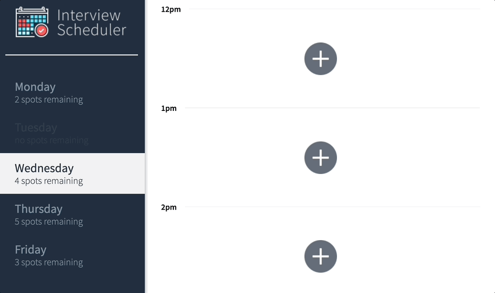
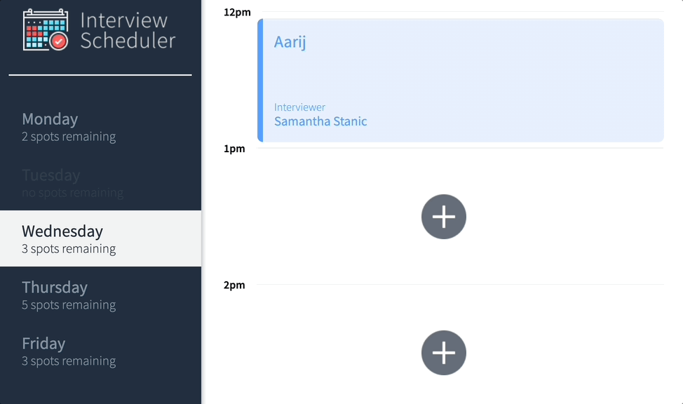

# Interview Scheduler

Interview Scheduler is a single-page application (SPA) that allows users to book technical interviews between students and mentors. 

Appointments can be between the hours of 12 PM and 5 PM, Monday to Friday. Each appointment has one student and one interviewer. When creating a new appointment, the user can enter any student name while the interviewer is chosen from a predefined list. The user can save the appointment and view the entire schedule of appointments on any day of the week. Appointments can also be edited or deleted. 

The front end of this project is built with React and makes requests to an API to fetch and store appointment data from a database.

## Setup

1. Install dependencies with `npm install`.
2. Run the Webpack Development Server. Change directories to ```scheduler-api``` and type ```npm start```.
3. Run the React application. Change directories to ```Scheduler``` and type ```npm start```. 
4. The application will open in your browser window.

## Running Jest Test Framework
In the ```Scheduler``` folder, type ```npm run test```.

## Running Storybook Visual Testbed
In the ```Scheduler``` folder, type ```npm run storybook```. You will find the link to Storybook stories in the terminal.

## Dependencies

### React App
- axios: ^0.20.0
- classnames: ^2.2.6
- normalize.css: ^8.0.1
- react: ^16.9.0
- react-dom: ^16.9.0
- react-scripts: 3.4.4

### Webpack Development Server
- body-parser": ^1.18.3
- cors": ^2.8.5
- dotenv": ^7.0.0
- express": ^4.16.4
- helmet": ^3.18.0
- pg": ^8.5.0
- socket.io": ^2.2.0
- ws": ^7.0.0

## Screenshots

### Booking Appointment - With Error Checking


### Editing Appointment - Change Name OR Interviewer


### Deleting Appointment
